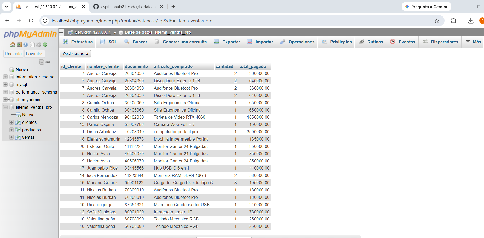

# 🚀 Portafolio de Proyectos Python - Paula Andrea

Colección de herramientas desarrolladas para demostrar habilidades en lógica de programación, manejo de datos y estructuras de control.

---

## 📸 Proyectos y Evidencias

### 🛒 1. Gestión de Mercado y Facturación
Este programa calcula compras, maneja inventario y genera un archivo de texto con el resumen de la venta.

### 🎮 2. Juego: Adivina el número
Un juego interactivo que utiliza números aleatorios y contadores para registrar los intentos del usuario.

### ⚖️ 3. Calculadora de IMC
Calcula el índice de masa corporal basándose en el peso y altura, clasificando el resultado según rangos de salud.

### 📝 4. Lista de Tareas
Una herramienta funcional para gestionar pendientes permitiendo agregar, ver y borrar tareas de una lista.

### 📸 5.Prueba de funcionamiento:

## 6. Juego de Superhéroes 🦸‍♀️✨
¡He mejorado mis habilidades! Diseñé un juego interactivo que utiliza bucles `while`, condicionales `if/else`, listas y diccionarios para registrar campeones.

## 7.Base de Datos - Sistema de Ventas Pro📊

Este proyecto incluye una base de datos relacional robusta en MySQL para gestionar el inventario, clientes y ventas de la tienda.

Aquí se puede ver el reporte unificado de las ventas en vivo:

